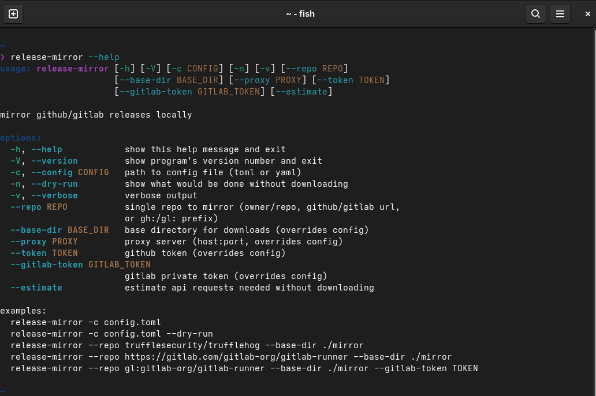

# release-mirror

mirror github/gitlab releases locally. downloads all release assets and keeps them in a structured directory.



## installation

```bash
pip install .
pipx install .
```

## usage

```bash
# with config file
release-mirror -c config.yaml
release-mirror -c config.toml

# single repo (github)
release-mirror --repo trufflesecurity/trufflehog --base-dir ./mirror
release-mirror --repo https://github.com/VSCodium/vscodium --base-dir ./mirror

# single repo (gitlab)
release-mirror --repo gl:gitlab-org/gitlab-runner --base-dir ./mirror
release-mirror --repo https://gitlab.com/gitlab-org/gitlab-runner --base-dir ./mirror

# self-hosted gitlab
release-mirror --repo https://gitlab.example.com/owner/repo --base-dir ./mirror

# dry-run (no downloads)
release-mirror -c config.yaml -n

# verbose
release-mirror -c config.yaml -v
```

## config

toml:
```toml
base_dir = "/var/lib/release-mirror"
proxy = "proxy.example.com:8080"

# both optional
github_token = "ghp_xxx"
gitlab_token = "glpat_xxx"

urls = [
    "https://github.com/trufflesecurity/trufflehog",
    "https://github.com/VSCodium/vscodium",
    "https://gitlab.com/gitlab-org/gitlab-runner",
    "gl:owner/repo",
]
```

yaml:
```yaml
base_dir: /var/lib/release-mirror
proxy: proxy.example.com:8080
github_token: ghp_xxx
gitlab_token: glpat_xxx

urls:
  - https://github.com/trufflesecurity/trufflehog
  - https://github.com/VSCodium/vscodium
  - https://gitlab.com/gitlab-org/gitlab-runner
```

## directory structure

```
base_dir/
├── GitHubReleases/
│   └── owner/
│       └── repo/
│           ├── latest -> v1.2.3
│           ├── v1.2.3/
│           │   ├── asset1.tar.gz
│           │   └── asset2.zip
│           └── v1.2.2/
│               └── ...
└── GitLabReleases/
    └── owner/
        └── repo/
            ├── latest -> v1.0.0
            └── v1.0.0/
                └── ...
```

### latest

`latest` is a symlink to the newest non-prerelease tag directory.

## features

- github and gitlab support (including self-hosted gitlab)
- proxy support (format: `host:port`, uses http for both http/https)
- rate limit handling (waits when < 10 remaining)
- retry logic (max 3 attempts on 5xx/network errors)
- file timestamps set to github/gitlab `updated_at`
- atomic symlink updates
- dry-run mode
- toml and yaml config

## hash verification

github provides sha256 digests via api (since june 2025). gitlab does not.

for older github releases and gitlab, sidecar checksum files are parsed as fallback:
- `checksums.txt`, `*_checksums.txt`
- `SHA256SUMS`, `sha256sums.txt`
- per-file `*.sha256`, `*.sha256sum`

checksum files are downloaded first, parsed, and hashes verify other assets. existing files are checked against expected hash, mismatches result in error and exit code 1.

## options

```
-c, --config        config file (toml or yaml)
-n, --dry-run       show what would be done
-v, --verbose       debug output
--repo              single repo (owner/repo, url, or gh:/gl: prefix)
--base-dir          override base directory
--proxy             override proxy
--token             github token
--gitlab-token      gitlab private token
--estimate          estimate api requests needed
```

## proxy

the proxy is configured as `host:port` (e.g., `proxy.example.com:8080`).
internally prepends `http://` and uses it for both http and https requests.

## file timestamps

all downloaded files have their modification time (mtime) set to the `updated_at` timestamp from the github/gitlab api. this preserves the original upload time.

## rate limits

| platform | without token | with token |
|----------|---------------|------------|
| github | 60/hour | 5,000/hour |
| gitlab.com | 500/min | 2,000/min |
| gitlab self-hosted | disabled by default (3,600/hour if enabled) | disabled by default (7,200/hour if enabled) |

for repos with many releases, a token is recommended.

## url formats

| format | platform | example |
|--------|----------|---------|
| full url | auto-detect | `https://github.com/owner/repo` |
| full url | auto-detect | `https://gitlab.com/owner/repo` |
| self-hosted | gitlab | `https://gitlab.example.com/owner/repo` |
| shorthand | github | `owner/repo` |
| prefix | github | `gh:owner/repo` |
| prefix | gitlab | `gl:owner/repo` |

## development

```bash
pip install -e ".[dev]"
```

### linting and formatting

all pass

```bash
ruff check src tests
ruff format src tests
black src tests
mypy src
```

ruff handles linting (pycodestyle, pyflakes, isort, bugbear, etc). black for formatting. mypy for type checking with `disallow_untyped_defs`.

### tests

still need to be written, will be in pytest

## roadmap

potential future features

- [ ] tests
- [ ] parallel downloads, structure is ready, would use `ThreadPoolExecutor`, checksum files first then assets in parallel, rate limit locking?
- [ ] asset filtering